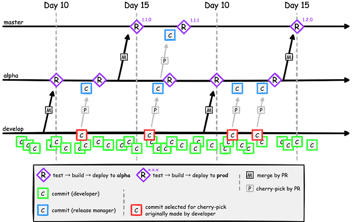
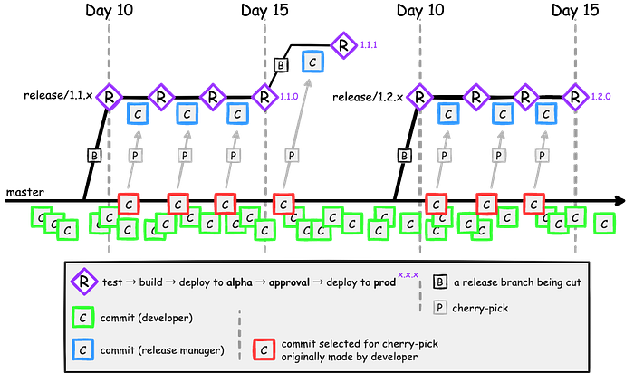

TBD 是一種版本控制的分支模型（source-control branching model），為了避免傳統 Git workflow 帶來的合併地獄，TBD 規定開發人員只能在被稱作「Trunk」的單一 branch 中提交程式碼，並且限制建立其它會長期存在的 branches。

## 前言

大家的公司或團隊，都是怎麼跑 Git workflow 呢？在執行上有沒有遇到什麼問題呢？這篇文章想要來聊聊我們團隊遇到的問題，以及解決的方式。

## 想解決的問題

在說明遇到的問題之前，先來看下面這張圖，這是我們團隊目前正在跑的 Git workflow：

1. 一個 sprint 是 15 天（三週）
2. 有三支需要 maintain 的 branches：`develop`、`alpha` 和 `master`，分別對應上線的 server 環境 `staging`、`QA` 和 `production`
3. Day 1～Day 10 為**開發期**，全部的 feature 都是從 `develop` 分支、對 `develop` 送 PR，code review 沒問題之後 merge 進 `develop`，接著 CI 就會自動 deploy 到 `staging` server
4. Day 10 開始進入**測試期**，我們的 GitHub 會自動開一個 merge `develop` to `alpha` 的 release PR，每個 sprint 安排一位 release manager 負責 review，沒問題的話，就 merge 進 `alpha`，接著 CI 自動 deploy 到 `QA` server，QA 開始測試
5. 測試期間，工程師仍然可以繼續對 `develop` 送 feature 相關的 code，流程同開發期
6. 測試期間，如果 QA 測出問題，工程師修正的 code 仍然是從 `develop` 分支、對 `develop` 送 PR，接著 release manager 會 `git cherry-pick` 相關 commits 到一個新的 release PR，沒問題之後，merge 並且 deploy 到 `QA` server 讓 QA 驗證
7. Day 15，GitHub 會自動開一個 merge `alpha` to `master` 的 release PR，如果 QA 覺得沒問題，release manager 就會 merge 進 `master`，CI 自動 deploy 到 `production` server，完成這次 sprint 的產品交付（例如上圖的 `1.1.0` 和 `1.2.0`）
8. 如果是緊急的問題，需要馬上修復（**Hotfix**），無論是開發期或是測試期，工程師一樣還是從 `develop` 分支、對 `develop` 送 PR，merge 之後，release manager 一樣走上面流程 release 到 `QA` server 給 QA 驗證，沒問題之後再開一個 merge 到 `master` 的 release PR，`git cherry-pick` 相關 commits，merge 之後 deploy 到 `production` server，完成緊急修復（例如上圖的 `1.1.1`）

## 問題 1：Conflicts

在 Day 10 和 Day 15 這兩天，GitHub 開出的 release PR 常常會遇到 conflicts，而且這些 conflicts 通常因為時間久遠、commits 量大，導致 release manager 很難解 conflicts，容易發生解錯的風險。

## 問題 2：Out of date

為了確保 codebase 一致，我們的 GitHub `alpha` 和 `master` branch 有打開 `[Require branches to be up to date before merging](https://docs.github.com/en/repositories/configuring-branches-and-merges-in-your-repository/defining-the-mergeability-of-pull-requests/about-protected-branches)` 的檢查。但是在測試期間，因為大家會頻繁的對 `alpha` 送修正的 PR，導致 PR 很容易出現 `out-of-date` 的情況，必須 `git rebase` or `git merge` 之後，再重頭跑一遍 CI。

## 問題 3：Hotfix

如果是 Hotfix 流程，一共需要開 3 次 PR（對象是 `develop`、`alpha` 和 `master`）、跑 3 遍 CI、等 3 次 PR approve，但是它們的 change list 其實是一樣的。

---

為了解決這三個問題，我參考了許多 TBD 相關文章，嘗試重新設計我們的 Git workflow。

## 什麼是 TBD？

TBD 是 **Trunk Based Development** 的縮寫。是一種 Git 管理模型 or 策略，Google 和 Facebook 都有在使用。

[Trunk Based Development](https://trunkbaseddevelopment.com/)

（中文 [https://tw.trunkbaseddevelopment.com/](https://tw.trunkbaseddevelopment.com/)）

其它類似的模型還有：[Git flow](https://www.atlassian.com/git/tutorials/comparing-workflows/gitflow-workflow)、[GitHub flow](https://docs.github.com/en/get-started/quickstart/github-flow) 以及 [GitLab flow](https://docs.gitlab.com/ee/topics/gitlab_flow.html)。

## 改動的部分

下圖是參考 TBD 調整之後的 workflow：

* 將原先的三支 branches（`develop`、`alpha` 和 `master`）**縮減成一支 trunk branch（**`master`**）**
* 無論是開發期、測試期或是 Hotfix，工程師只能從 `master` 分支、對 `master` 送 PR（這部分跟原本的差不多，只是從 `develop` 變成 `master`）
* 取消 Day 10 和 Day 15 自動開 release PR 的機制，改成 Day 10 自動從 `master` 開一支 **release branch**（branch 的 prefix name 需為 `release/`）
* Release branch 會觸發 CI 執行如下圖的 jobs：

*CircleCI 示意圖*

* 我們將原本 CI 的 `release alpha` 和 `release prod` 兩個 workflow 合二為一，release branch 會直接 deploy `QA` server，但是因為後面接著 `approve-deploy-prod`（CircleCI 提供的 [approval](https://circleci.com/blog/manual-job-approval-and-scheduled-workflow-runs/) 功能），所以不會馬上 deploy 到 `production` server
* 測試期間的修正 commits 會由 release manager `git cherry-pick` 到 release branch，然後一樣觸發上述 CI，deploy 到 `QA` server
* Day 15 如果 QA 沒問題，release manager 直接點擊 CI 的 `approve-deploy-prod`，deploy 到 `production` server（例如圖中的 `1.1.0` 和 `1.2.0`）
* 如果要 hotfix，改成直接從 latest tag（例如 `1.1.0`）開 release branch，之後的流程同上（例如圖中的 `1.1.1`）

## 好處 1

因為已經沒有 `develop` 和 `alpha` 需要維護了，所以就不會為了 sync branch 而產生不必要的 conflicts 了，可以省下大家解 conflicts 的時間。

## 好處 2

因為已經改用 release branch 取代 release PR，所以也不會有 PR out of date 的問題了，除了省下時間、也省下重跑 CI 的成本。

## 好處 3

Hotfix 流程變成只需要開 1 次 PR（原本 3 次）、跑 2 遍 CI（原本 3 遍）、等 1 次 PR approve（原本 3 次），省時＋省力＋省錢。

## 結語

當然，新的流程勢必也存在新的問題，例如可能需要更仰賴 [Feature flags](https://trunkbaseddevelopment.com/feature-flags/) 的機制等，但是經過與團隊的交流討論，我覺得大部分疑慮都是可以解決的，如果這個 flow 總體帶來的效益大過這些疑慮的話，我認為還是有一試的價值。

## 參考資料

* [Trunk Based Development](https://trunkbaseddevelopment.com/)（[中文](https://tw.trunkbaseddevelopment.com/)）
* [筆記：TBD是三小? — -What is Trunk Based Development?](https://nedwu13.blogspot.com/2014/01/tbd-what-is-trunk-based-development.html)
* [Trunk-based Development | Atlassian](https://www.atlassian.com/continuous-delivery/continuous-integration/trunk-based-development)
* [DevOps tech: Trunk-based development | Google Cloud](https://cloud.google.com/architecture/devops/devops-tech-trunk-based-development)
* [版本分支管理標準- Trunk Based Development 主幹開發模型](https://www.itread01.com/hkyfeii.html)
* [『前端进阶』 — — 代码管理方案之Trunk-based Flow](https://juejin.cn/post/6977942781209608200)
* [git 开发流程 gitflow githubflow gitlabflow TrunkBase AoneFlow 以及持续集成](https://juejin.cn/post/6891583607262068750)
* [字节研发设施下的 Git 工作流](https://juejin.cn/post/6875874533228838925)
* [Git 分支管理策略总结](https://juejin.cn/post/6844904203115036685)
* [如何在微服务团队中高效使用 Git 管理代码？](https://juejin.cn/post/6875874533228838925)
* [Google 是如何开发 Web 框架的](https://juejin.cn/post/6844903464477130765)
