這是我在公司的前端聚會上分享的主題，介紹 Heptabase 這個筆記工具，以及我如何使用它來完成「Hahow for Business 企業上傳串 JW Player」的研究過程。大綱如下：

1. 前言
2. Heptabase 簡介
3. 如何使用 Heptabase
4. 我如何使用 Heptabase
5. 總結

## 前言

這篇文章要介紹的是 [Heptabase](https://heptabase.com/) 這個筆記工具，以下我將簡稱它為 Hepta。

雖然這個主題和前端工程師可能沒太大關係，但是大家在學習的過程中，或多或少需要做一些筆記。所以我想分享一下我最近使用的這款筆記工具。

最近在負責將 [Hahow for Business](https://business.hahow.in/) 的 VOD 從 AWS 換到 [JW Player](https://jwplayer.com/)。Hahow for Business 的影片分為「訂閱制」和「企業上傳」兩種。前者是由 Hahow 提供選購的課程；後者是由企業內部自行上傳的課程。雖然兩者都是 VOD，但它們背後使用的套件和架構是完全不同的。

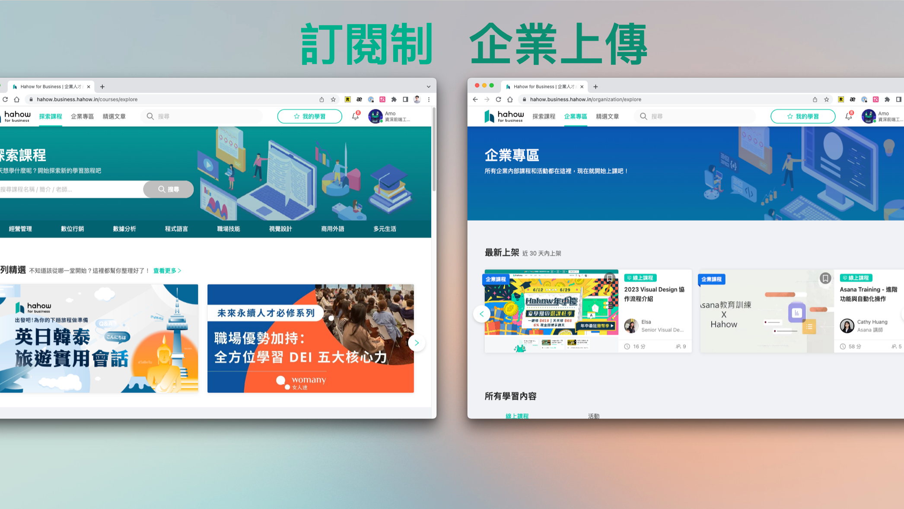

訂閱制比較簡單（背後是 Ruby on Rails 內建的 [Active Storage](https://edgeguides.rubyonrails.org/active_storage_overview.html)），目前已經串完 JW Player 並上線運行一陣子了。最近開始處理「企業上傳」的部分，因為「企業上傳」的架構比「訂閱制」複雜得多（背後是第三方的套件 [CarrierWave](https://github.com/carrierwaveuploader/carrierwave)），加上我沒有這部分的背景知識，所以很多地方我完全不知道它是如何運作的。

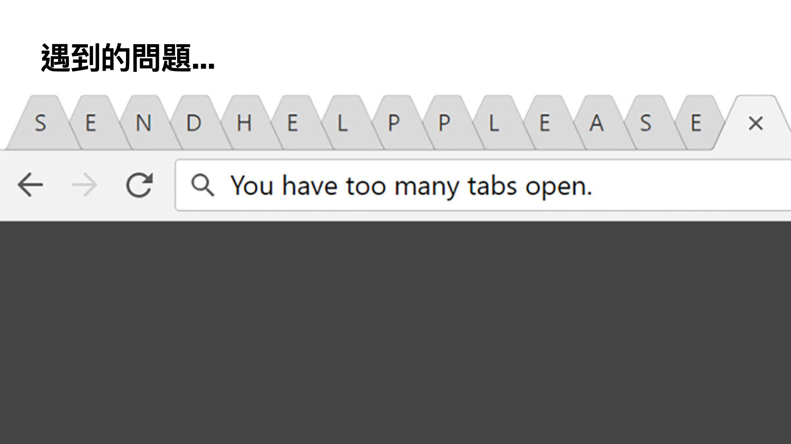

一開始預到的問題是，我會一個一個檔案打開來研究程式碼，但是時間久了，我的 Chrome 和 VS Code 就會累積一堆 tabs。這樣不只是尋找檔案會很麻煩，可能休個假回來，就會想不起來之前研究到哪裡，變成又要從頭開始。所以我認為我需要一個工具來幫助我學習。

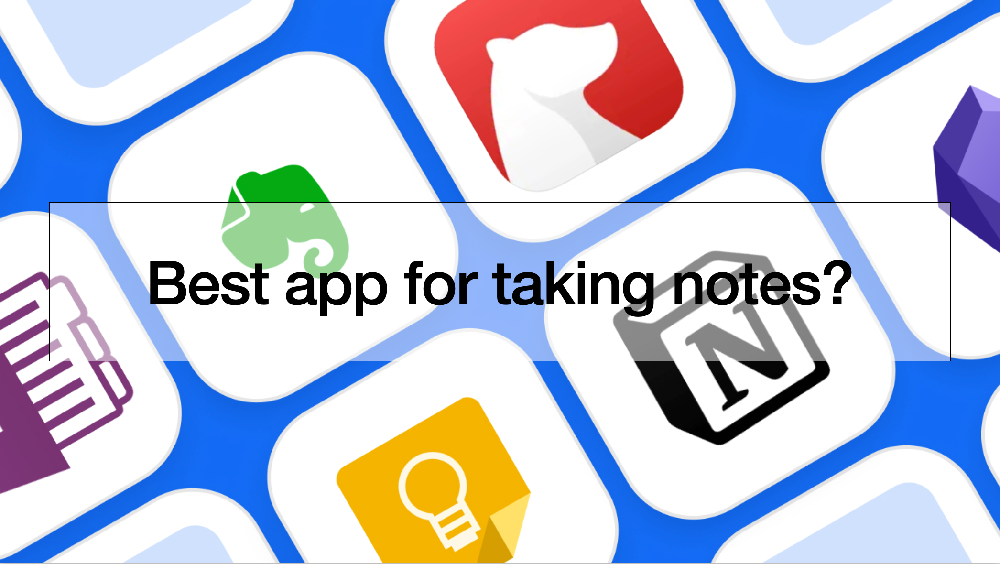

我是一個很喜歡折騰筆記工具的人，無論是最早的 Evernote 和 OneNote，或是後起之秀 Bear 和 Notion，以及近幾年因為**雙向連結（Bi-Directional Links）**火起來的 Rome Research 和 Obsidian，我都用過一段時間，可能買過的筆記軟體比我寫過的筆記還多（笑）。我也經常私訊我們產品負責人，希望 Hahow 可以做個 PKM 功能，不過每次都被笑笑打發掉（笑）。

說到雙向鏈接，想順便推薦一下《How to Take Smart Notes》這本書，近幾年在筆記圈相當火，它在介紹一種叫做「卡片盒筆記法」的方法論。這是一位德國學者叫做魯曼（Luhmann）發明的，他靠著這套方法在很多領域貢獻了許多論文。

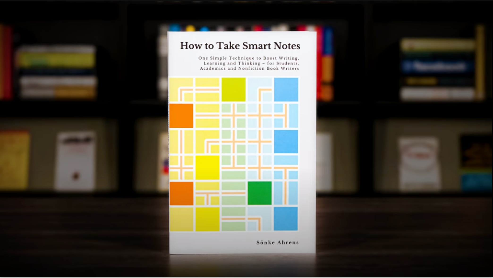

台灣出版社也有推出中譯本，有興趣的人可以買來讀一讀。

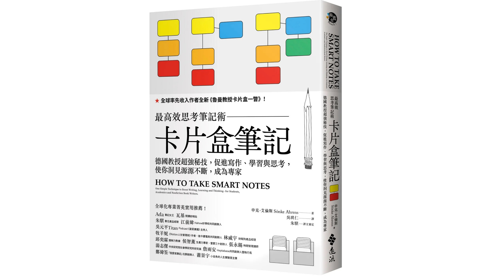
*仔細看推薦人竟然有 Hahow 的創辦人阿諾，以及接下來要介紹的 Heptabase 共同創辦人詹雨安*

如果不想看書的話，張永錫老師在 Hahow 有開一門《[卡片筆記術：高效內容產出的秘密](https://hahow.in/courses/623156dc32edfc0007190299?utm_source=share&utm_medium=link)》的課程，有興趣的朋友可以去支持一下。

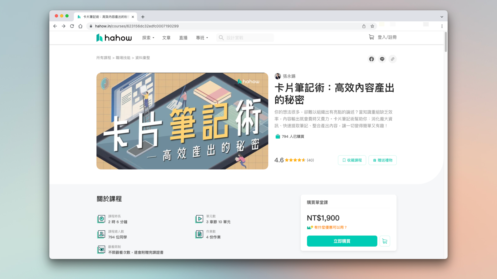

## Heptabase 簡介

雖然 Hepta 也是基於「卡片盒筆記法」構建的，但我不會太著墨這塊，這篇主要還是分享一下 Hepta 這個工具的使用。

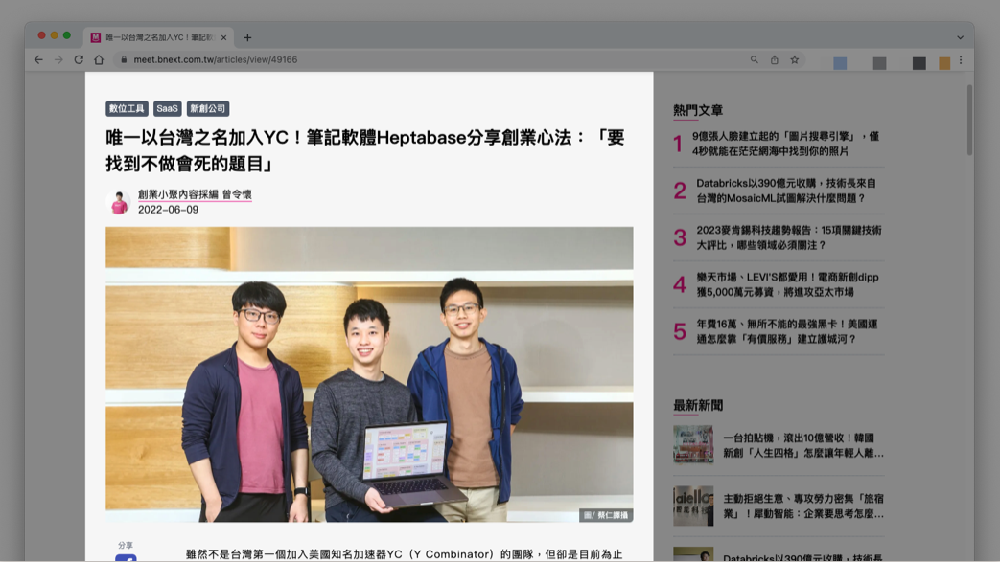

Hepta 是由幾位台灣人共同創辦的，上圖中間這一位就是前面提到的詹雨安（Alan），他認為現有的筆記工具都有各自的問題，不符合他的需求，所以就自己創業開發了 Heptabase。很厲害的是，他們獲得了矽谷知名的創業加速器 Y Combinator（YC）的投資，目前成立了約兩年左右。

Alan（[詹雨安 Alan Chan](https://medium.com/u/7f54ec92397a)）在 [Medium](https://alanchan1209.medium.com/) 上也寫了很多跟創業還有筆記相關的文章，而且都有提供中英文版本，推薦一讀。

---

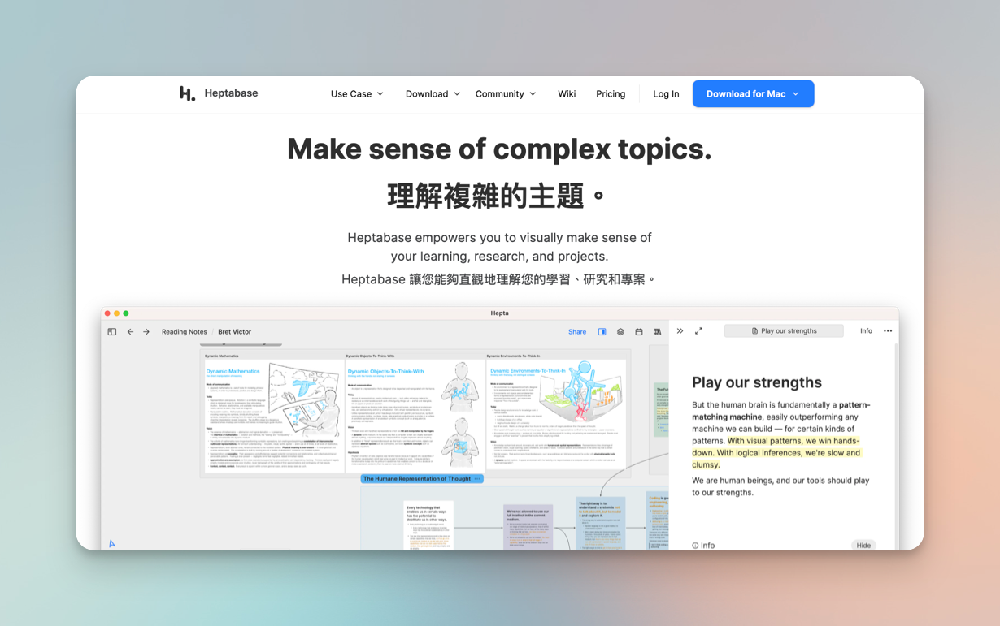

Hepta 在 Landing Page 上的標語，寫的是「理解複雜的主題，Heptabase 幫你直觀地理解你的學習、研究和專案」，Hepta 並沒有自稱是一個筆記或知識管理工具，而是更像一個思考的工具。

> Hepta 注重的是過程，而不是結果。

人類大腦更容易理解以視覺呈現的方式，Hepta 只有白板和卡片這兩個核心元素，你可以用任何習慣的呈現方式來組織你的卡片筆記。

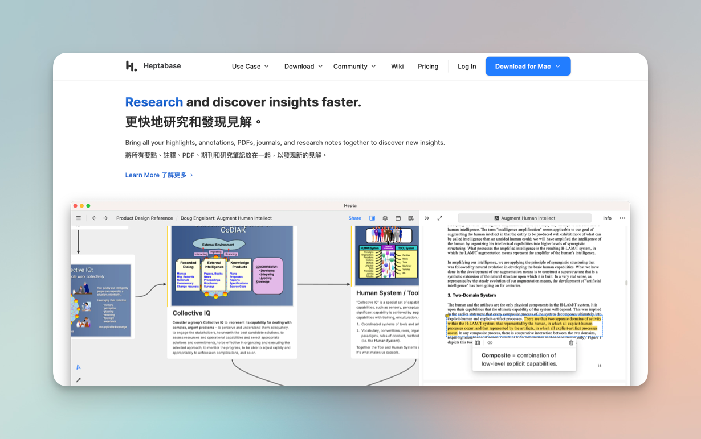

Hepta 可以把任何筆記段落直接拖拉到白板變成一張筆記卡片，而且原本的筆記段落也會變成一個雙向連結。這樣一來，除了可以把知識粒度變小之外，還可以在任何地方重複使用這張筆記卡片。

## 如何使用 Heptabase

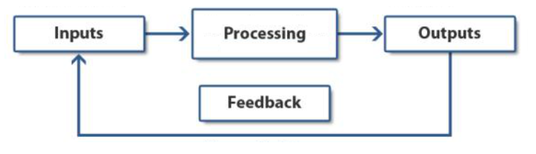

上圖是知名的 IPO Model，IPO 就是 Input、Process 和 Output，很多領域都可以套用這個模型，知識管理也可以套用這個模型。我們做筆記的過程就是吸收各種 Input，然後在筆記工具上進行 Process，最後產出各種 Output。

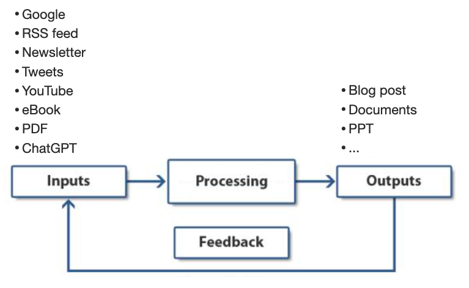

以我自己來講，我的 Input 通常來源是 Google 上搜尋到的文章、我訂閱的 RSS、Newsletter，或是在 Twitter 或 YouTube 上看到的內容，其它還有像是一些電子書和 PDF 的論文，還會最近一直使用的 ChatGPT 回答的結果之類的。我的 Output 可能就是希望它會變成我工作上的技術文件、分享會上用到的簡報，或是一篇部落格文章。

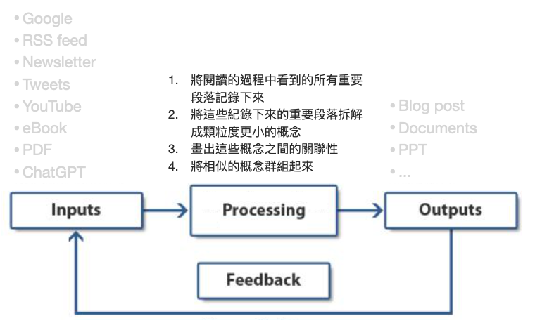

各種筆記軟體在做的就是中間這一塊，每一家筆記軟體的設計哲學可能都不一樣，以 Alan 在[文章](https://medium.com/heptabase/the-best-way-to-acquire-knowledge-from-readings-abf9357814d1)中建議的步驟為例：

1. 第一步會先將閱讀的過程中看到的東西，所有重要的段落**記錄**下來
2. 第二步是把這些記錄下來的段落**拆解**成更小的概念
3. 第三步就是畫出這些概念之間的**關聯性**
4. 然後最後一步就是把這些相似的概念**群組**起來

## 第一步：將閱讀的過程中看到的所有重要段落記錄下來

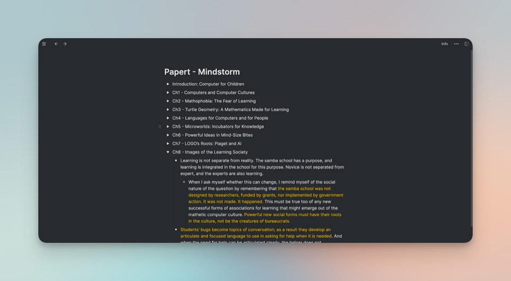

第一步中，Alan 建議把在閱讀過程中看到的重要段落記錄下來。這個過程的實作方式可能會根據你使用的工具而有所不同，不管你採用哪種方式做筆記，只要確保最終會產出一張「重點卡片」，裡頭包含你在學習過程中所紀錄的重要段落即可。

## 第二步：將這些紀錄下來的重要段落拆解成顆粒度更小的概念

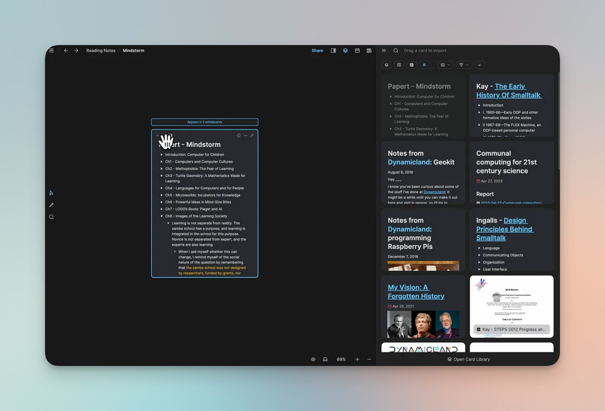

接著你可以建立一個白板，並透過 Hepta 右上角的 Import Panel 將卡片從 Card Library 拉進這個白板裡頭。

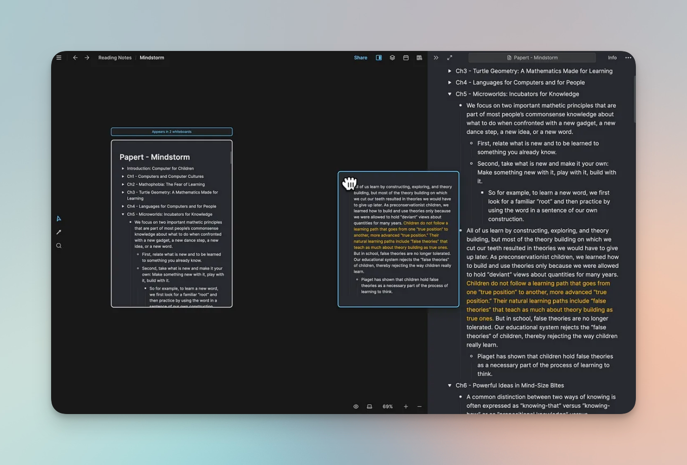

當卡片拉進白板之後，Alan 會把它點開到右側欄，讓他更方便地瀏覽裡面的內容。Alan 通常會先快速掃過一遍這張卡片的所有內容，然後將裡面所有重要的概念識別出來。當他決定要把一個概念萃取出來時，**他會把與這個概念有關的區塊選取起來一口氣拖曳到白板上變成一張新的「概念卡片」。**

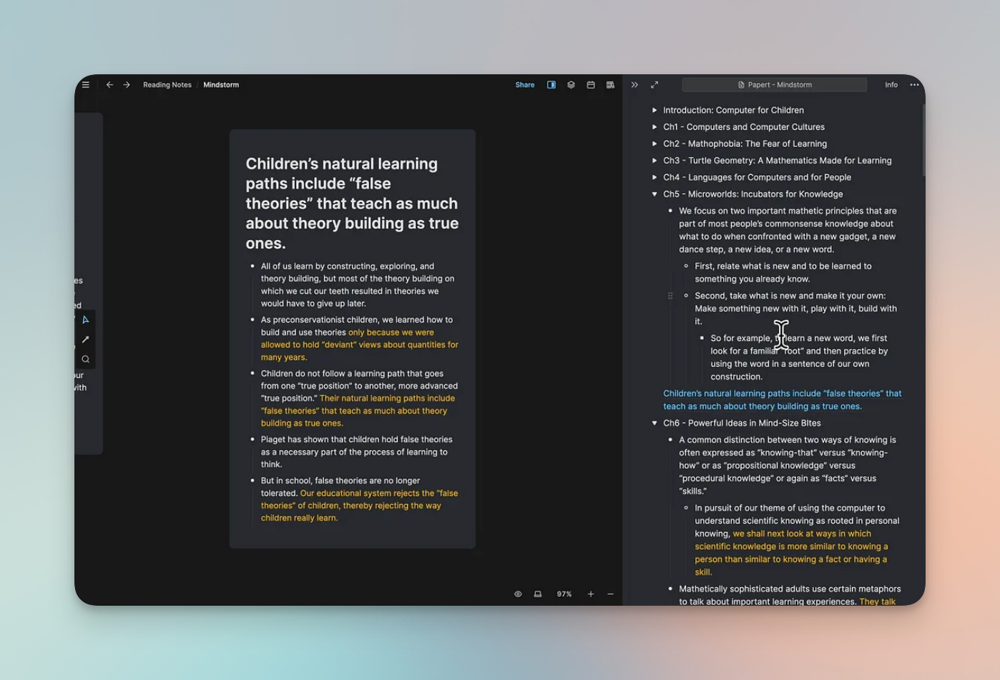

只有建立卡片還不夠，**他還會將這張卡片的核心概念用一句話總結，並以這句話當做是卡片標題，**以確保他一眼就能知道這張卡片在講什麼。接下來，Alan 會將這張「概念卡片」裡頭的內容重新組織，讓它的結構更符合自己的直覺；他也會看一下原本的「重點卡片」裡頭還有沒有其它與這張「概念卡片」相關的區塊，如果有的話，就把它們也拖進這張「概念卡片」裡頭。

## 第三步：畫出這些概念之間的關聯性

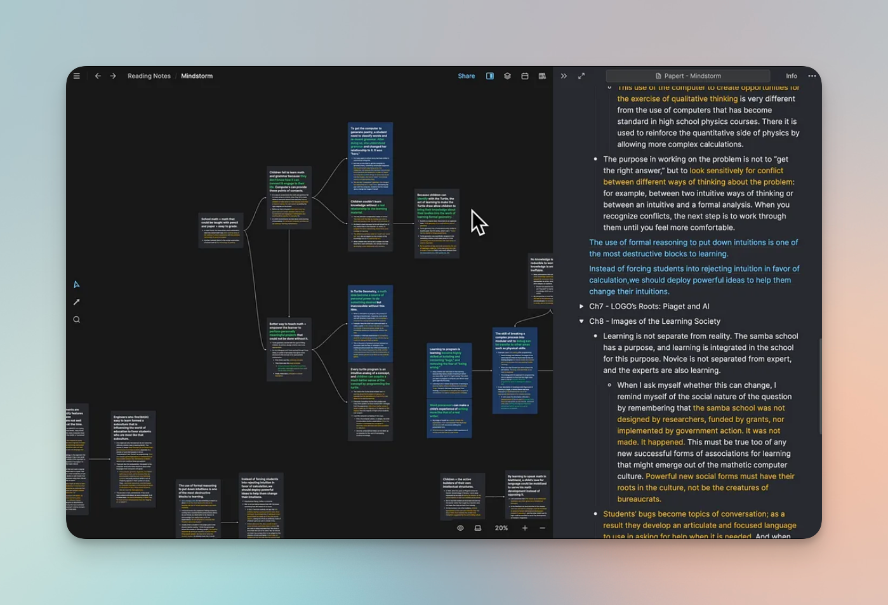

當 Alan 從重點卡片中萃取出愈來愈多「概念卡片」之後，**他就會開始在這些「概念卡片」之間畫箭頭，或是把內容相近的卡片放在一起**。如果他發現有兩張「概念卡片」的內容在討論相同的想法，他會將它們合併；如果他發現一張「概念卡片」裡頭包含的資訊量太大，他會把它拆解成多張更小的「概念卡片」來保持卡片的粒度。

## 第四步：將相似的概念群組起來

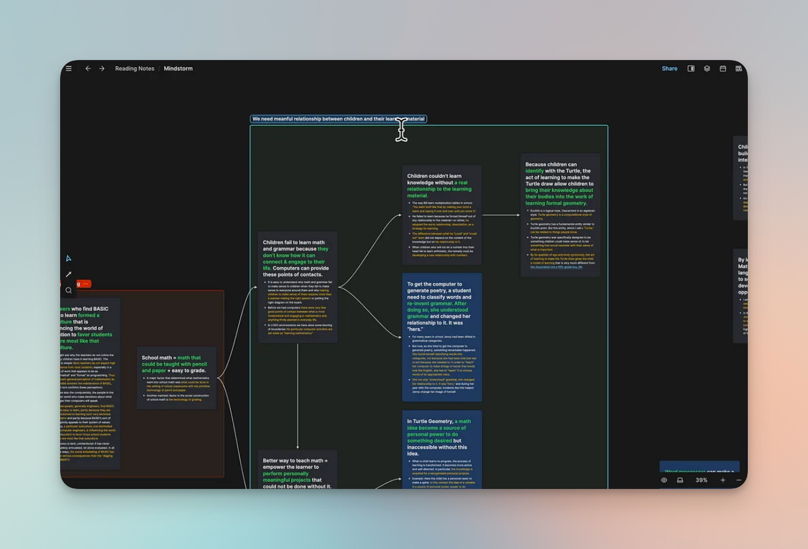

將「重點卡片」的內容都轉成「概念卡片」之後，Alan 會關掉右側欄，開始專心把這些「概念卡片」之間的關聯性和群組關係建立起來。當他發現有多張「概念卡片」都跟某個子題有關時，他會將它們用 Section 包起來，並給這個 Section 一個名字。在為 Section 取名時會跟為「概念卡片」下標題時一樣謹慎，因為這些名稱將會是未來回顧這個白板時第一眼看到的東西。

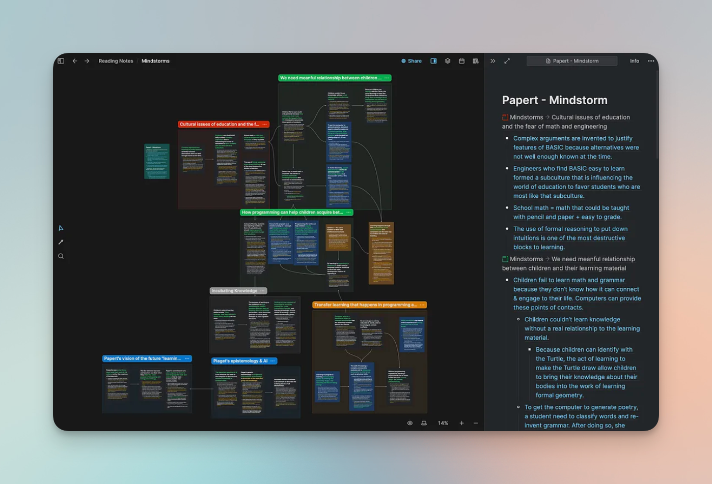

完成白板的排版之後，Alan 會把原本的「重點卡片」開在白板的右側欄，並將所有「概念卡片」和 Section 的連結重新貼回這張卡片上。

當你產出最終的白板後，吸收知識的階段就結束了。在這個過程中，真正有價值的並不是你最終產出的這個白板，而是你在執行第二步到第四步的過程中**建立知識架構、給每張概念卡片和 Section 下標題所投入的思考過程**。深度的理解和洞察往往源自於將知識分解、重組、用自己的話語描述的這個過程。**只有在走過這個過程後，這些知識才會真正內化成自己的知識**。

## 我如何使用 Heptabase

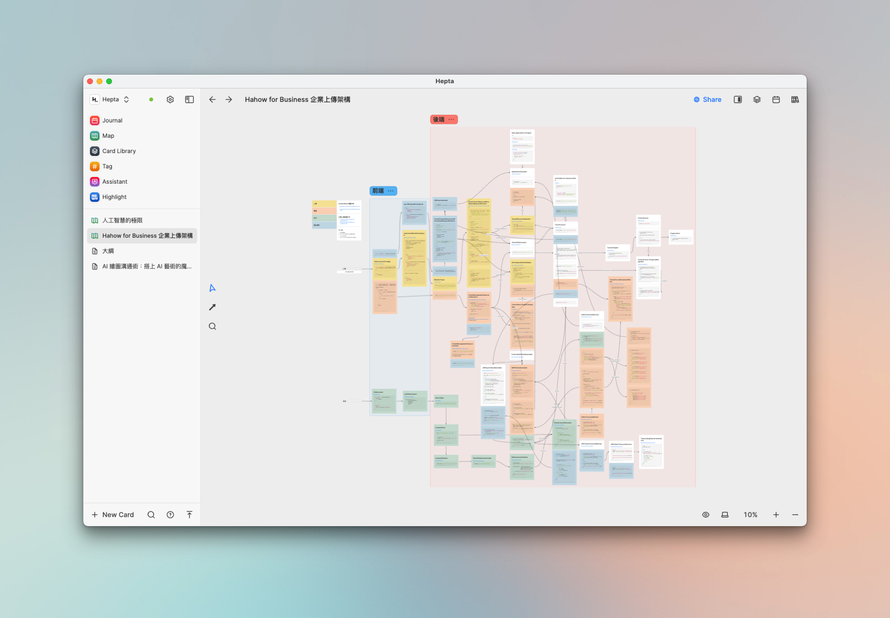

回到學習「Hahow for Business 企業上傳串 JW Player」的部分，我首先在 Hepta 建立了一個名為「Hahow for Business 企業上傳架構」的白板。

這裡我的使用方式跟 Alan 建議的方法不太一樣，因為我是在舊的架構上新增新功能，所以首先要釐清舊的架構，然後才能開始做新的功能。

我會先根據 VOD 的三個步驟：**上傳**、**轉檔**和**交付**，分別使用三種不同顏色來拆分卡片，這樣我可以比較容易一眼看出想尋找的卡片。

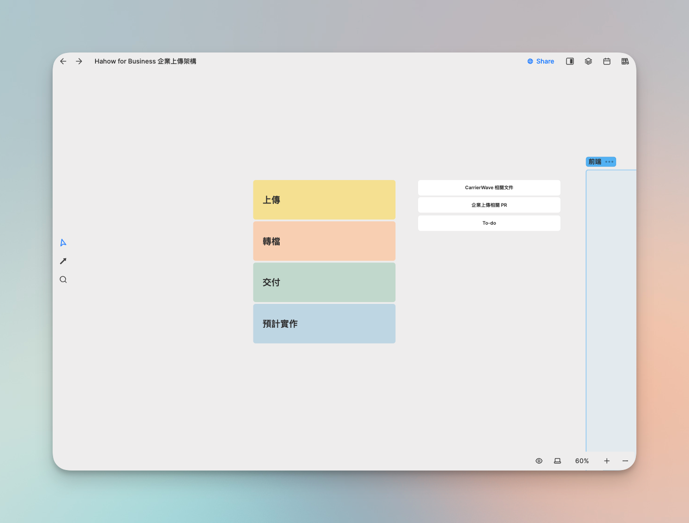

接著，我可能會從使用者的角度來切入。如果使用者想要跑完整個 VOD 的流程，首先，他必須進行上傳操作；其次，他需要觀看串流。

因此，使用者只會有這兩個進入點。

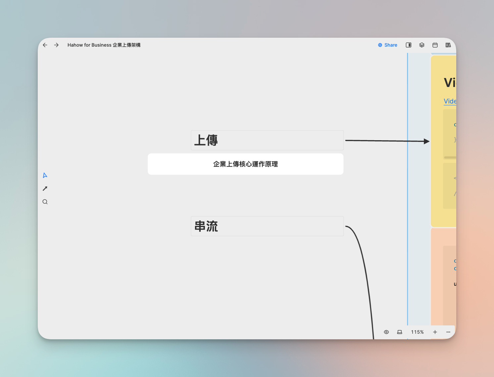

以上傳的過程為例，一開始會先接觸到前端一個名為 `VideoLessonFormApp` 的檔案。我會將相關的卡片都「黏」在一起，代表它們屬於同一檔案。但是同一個檔案底下，可能會有負責不同商業邏輯的程式碼，所以這裡就會用到前面提的顏色功能，例如：黃色代表上傳，橘色代表轉檔，藍色則是預計接下來要在這個檔案新增的程式碼。

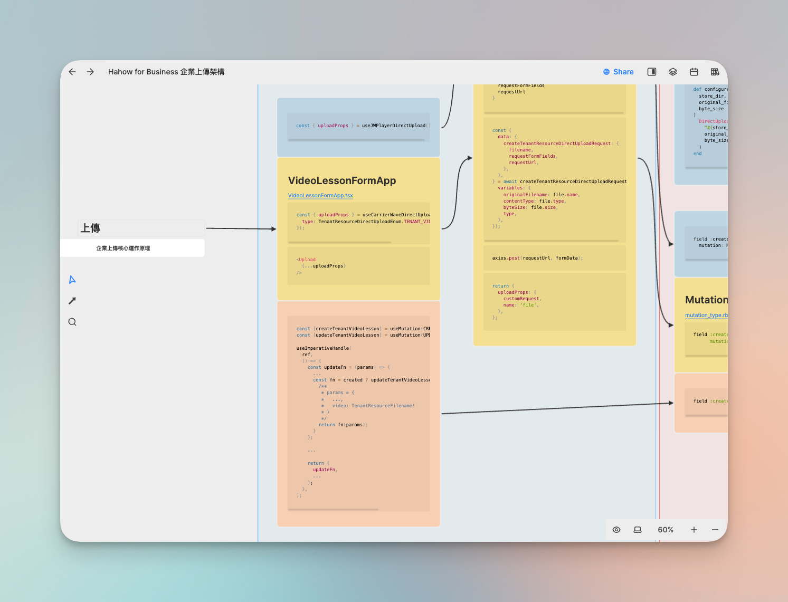

建立卡片的過程中，我只會貼上關鍵的程式碼，避免太繁雜。Hepta 可以支援程式碼區塊的格式，也支援語法高亮，對工程師來說非常方便。另外，Hepta 也支援一些像是數學符號如 LaTeX 格式，支援的格式種類相當多，包括影片和音訊檔案等，只要使用類似於 Notion 的操作，打一個「斜線」就能插入各種不同的元素。

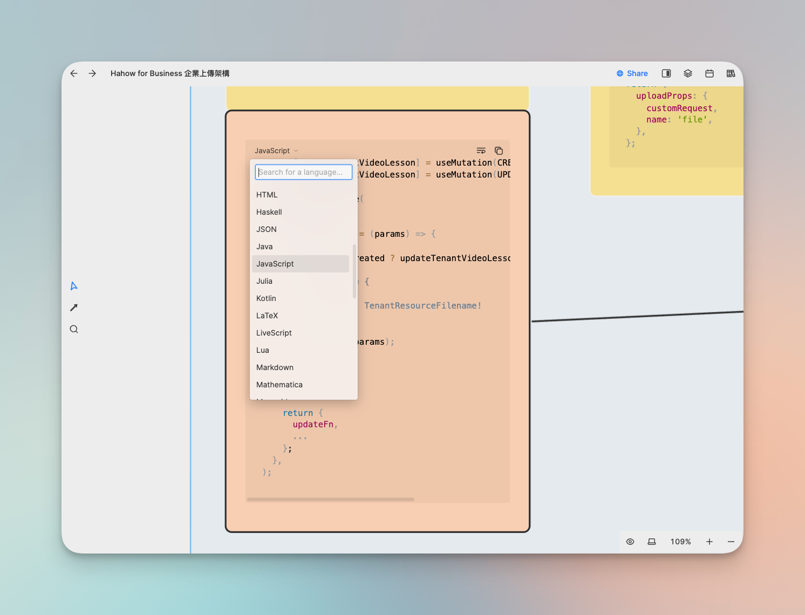

在學習的過程中，我也會使用畫線和 Section 功能將它們組織起來。目前我的分組方式是分為「前端」和「後端」兩個部分，線條之間的「標註」也可以幫助我理解它們之間的關係。

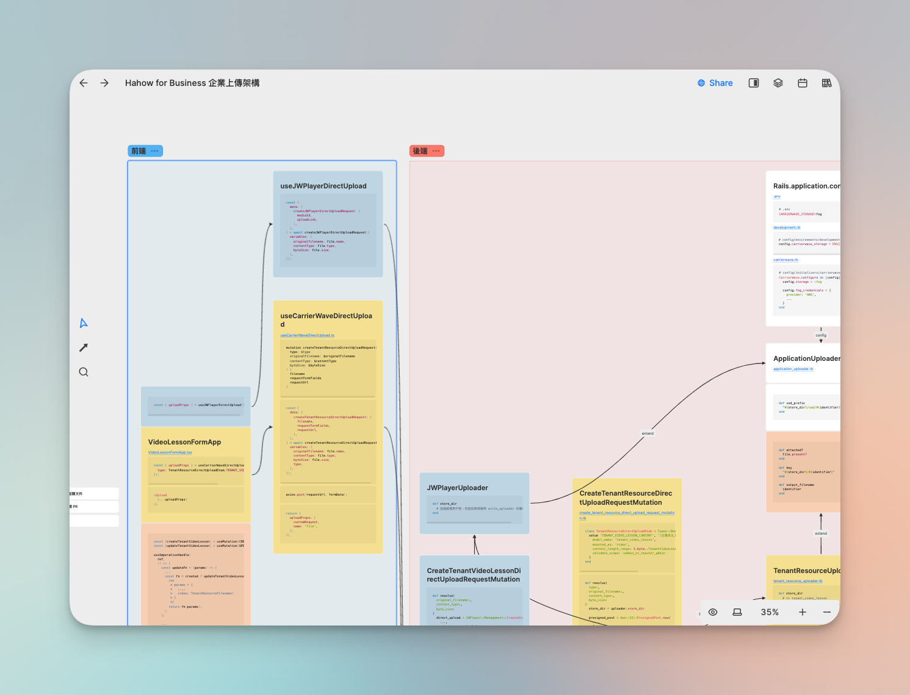

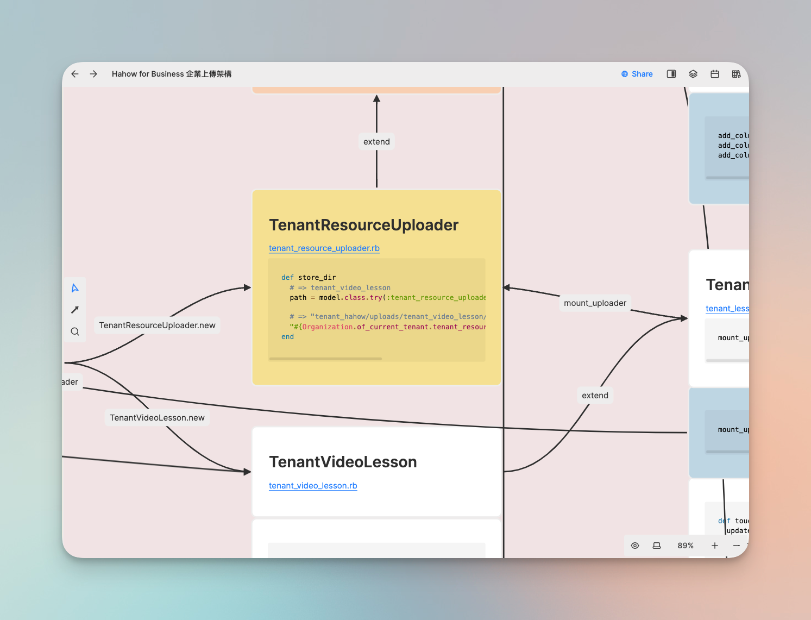

理清了所有關係之後，我就會開始進入預計實作的部分。這時我已經理解架構背後的運作原理，如果我要處理「上傳」JW Player 的部分，我就會找到上傳的「前端」＆「後端」的相關卡片，然後在上面新增一張藍色的卡片，直接參考關鍵程式碼的部分，一步一步在這張藍色卡片先寫上 pseudo-code。最後實際要在 VS Code 上寫程式時，我只需要打開白板，專注看藍色的卡片，一一實作相關的 pseudo-code 就可以完成了，不再需要打開一堆分頁。

最後，Hepta 也可以分享白板，不過因為這裡面是公司的程式碼，不方便分享上來，有興趣的朋友可以去試用官方分享的案例。

## One more thing

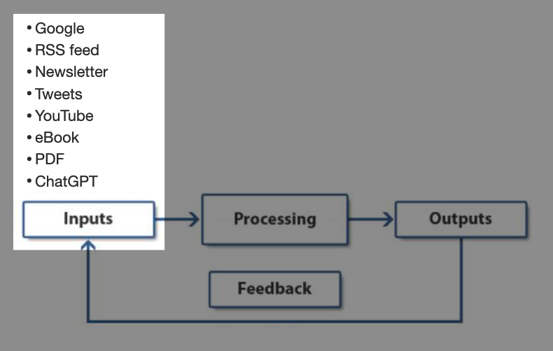

分享完 Hepta 之後，我想再分享一個額外的內容。剛剛在前面有提到，我的輸入來源很多，每個來源對應的閱讀工具可能都不一樣，比如說 Google 到的文章，我會丟到 Instapaper 來稍後閱；RSS 資訊，我會用 Feedly 來閱讀，但是最近發現了一個很方便的工具，叫做 Readwise Reader。

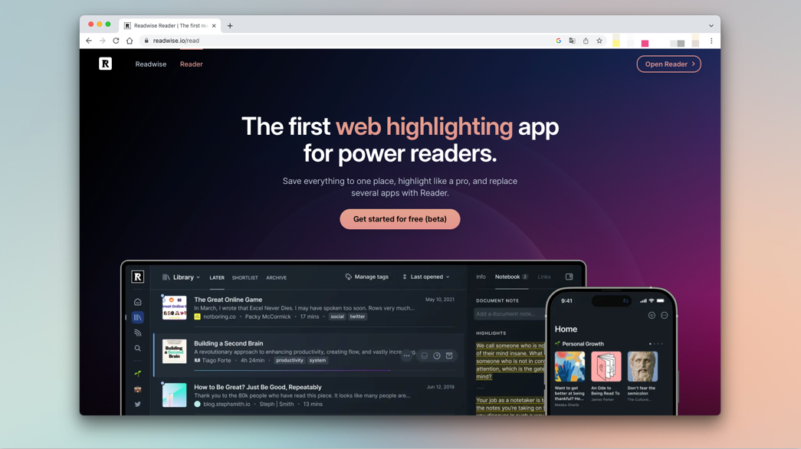

Readwise 原本只有提供文章的 Highlight 的服務，透過瀏覽器擴充外掛，可以在網站上 Highlight 文章重點並集中管理。最近他們推出了 Readwise Reader，可以整合多種來源，除了稍後閱讀之外，還支援 RSS 訂閱，上傳 ePub 電子書，還提供隨機信箱讓你訂閱 Newsletter！並且這些內容都可以在 Readwise Reader 上 Highlight。

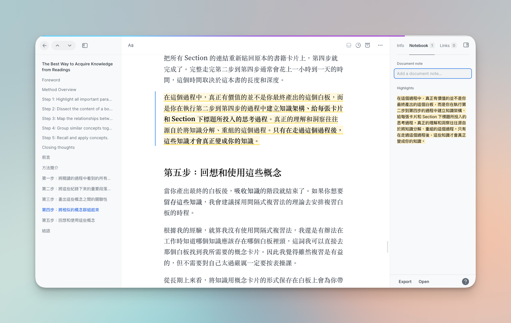

甚至 PDF 檔案除了文字可以 Highlight 之外，還可以 Snapshot 文件上的某個區塊，這對於筆記 AWS 架構圖這類 PDF 形式的文件來說非常方便。

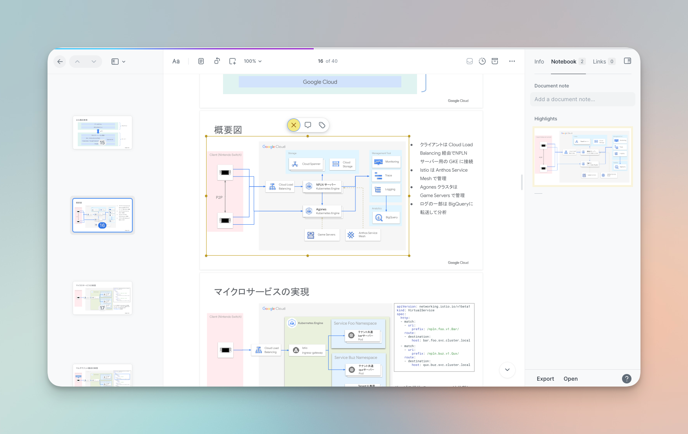

其中我認為很厲害的是，Readwise Reader 還可以列出 YouTube 影片的逐字稿，並且也可以 Highlight 重點。

---

回到 Hepta，最近也推出了一個 Highlight 功能，但不是重造輪子，而是與 Readwise 整合，只要你有設定 Readwise 的 access token，就可以將 Readwise 的 highlights 直接拉到白板上當卡片。這樣我就可以在白板上整理我所有看過的內容（Input），並添加箭頭和 Section 來整理思路，這對於寫作和輸出（Output）相當有幫助。

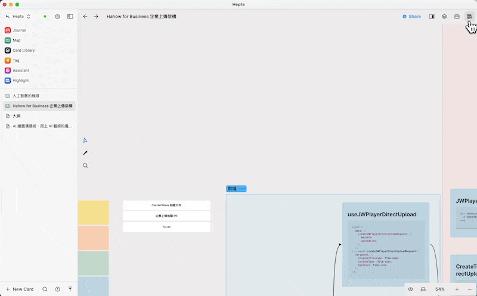

## 總結

總結一下 Hepta 的特點，相比目前其它筆記工具，Hepta 更加專注於學習的過程，不論是零散的想法還是學習的重點，搭配 Readwise 的 highlights，都能統一匯集到這個白板上，然後以自己習慣的方式組織思考，最後在進行寫作和輸出時，可以很方便地參考之前已經內化過的結構，達到快速產出的目的。

最後幫忙工商一下，就是 Heptabase 現在還在 beta 階段，他們每天的迭代速度很快，最近已經打算要發佈 1.0 版了，如果在 1.0 發佈之前訂閱的話，以後都會是永久早鳥價。如果有興趣的話，也可以去 [Product Hunt](https://www.producthunt.com/products/heptabase) 幫他們 upvote 一下，支持土生土長的台灣新創團隊。
